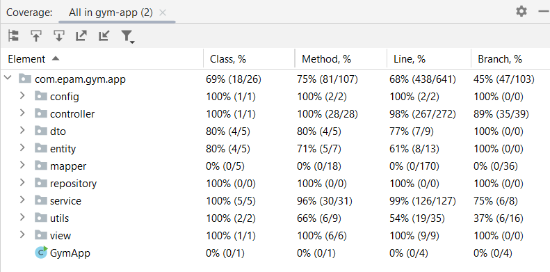
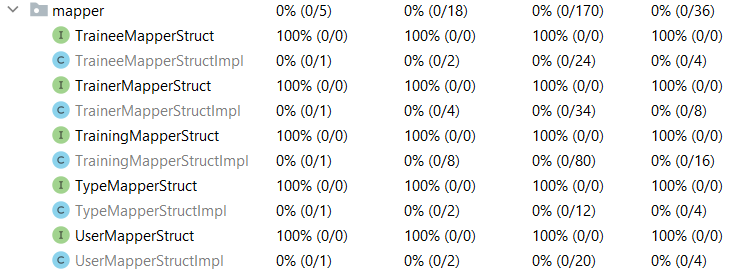
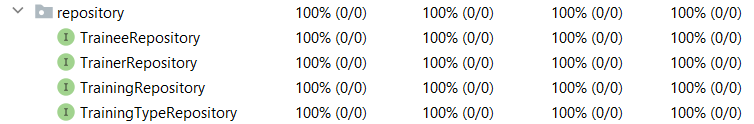

# Gym Application

## Table of Contents
1. [Introduction](#introduction)
2. [Technologies Used](#technologies-used)
3. [Getting Started](#getting-started)
4. [Additional Features](#additional-features)
5. [Contributing](#contributing)
6. [Pay attention](#pay-attention)
7. [Challenges](...)

## Introduction

This console application is developed as a task application for Epam company Java Specialization Course.
The application handles gym CRM system.

## Technologies Used

- Java 21
- Spring Boot
- Log4j2
- JUnit
- Jacoco
- MySql
- Liquibase
- Test containers

## Getting Started
- to build application the installed on your computer Docker application is required
- there are two database urls in localhost.env file, to run with Docker please uncomment:  
  DB_URL=jdbc:mysql://mysql-db:3306/gym_app_db  
  and comment:  
  #DB_URL=jdbc:mysql://localhost:3306/gym_app_db
- please, download to your PC the gym-app folder from the GitHub repository and extract files from the archive:  
  https://github.com/AndriiChipets/gym-app
- run the command line interface inside the folder "gym-app"
- before building, please make sure that you have stooped mysql server on your local machine, and the port 3306 is free
- to build an application Docker images and run containers, please run in cmd following command:  
  docker-compose --env-file ./localhost.env up --build
- you should be able to see program interface:  
  ============ Please, choose who are you ============  
  1 -> Trainee  
  2 -> Trainer  
- to run terminal inside container to interact with application open new terminal in the same folder and run cmd following command:  
  docker attach gym-app
- there is test data already added in the mysql DB, so to pass registration please use:  
  "1" (select Trainee from the previous menu)  
  "Fn.Ln" (Trainee username)  
  "1234567890" (Trainee password)  
- after registration, you should be able to see program interface:  
  ============ Please, choose the operation ============  
  1 -> Create Trainee  
  2 -> Update Trainee  
  3 -> Delete Trainee  
  4 -> Select Trainee  
  5 -> Change Trainee password  
  6 -> Activate/deactivate Trainee  
  7 -> Get Trainee Trainings list  
  8 -> Get Trainers List not assigned on Trainee  
  9 -> Add Trainer To Trainee's Trainers List  
  10 -> Remove Trainer From Trainee's Trainers List  
  11 -> Create Trainer  
  12 -> Update Trainer  
  13 -> Select Trainer  
  14 -> Change Trainer password  
  15 -> Activate/Deactivate Trainer  
  16 -> Get Trainer Trainings list  
  17 -> Create Training  
  18 -> Select Training  
  19 -> Select All Trainee  
  20 -> Select All Trainers  
  21 -> Select All Trainings  
  22 -> Select All TrainingTypes  
  0 -> To exit from the program  
- take your time and explore all gym-app functionality if you wish
- to stop the program CTRL+C is expected
- to delete containers, please run in cmd following command:  
  docker-compose --env-file ./localhost.env down
- to run create and run containers again (from existing images), please run in cmd following command:  
  docker-compose --env-file ./localhost.env up
- you should be able to see program interface:

## Additional Features

- Readme file to guide developers and contributors

## Contributing

Contributions are welcome! If you have ideas or improvements, feel free to submit a pull request.

## Pay attention
### To run all test you should have running Docker engine on your local machine
### The application is still under development, so bugs and drawbacks are possible.

## Challenges

There is a challenge with test coverage in module_3 (should be more than 80% line coverage but was 68%).
After investigation, I discovered that the reason is the MapperStruct library. 170 lines from 641 related to this library.

The MapperStruct Interface I used only in the service layer where I mocked its beans that's why it did not invoke explicitly and did not cover with tests.   
As I know it's not a good idea to test libraries that's why I didn't.  
Also, the repository layer is represented only with interfaces and all its tests not included to test coverage.
