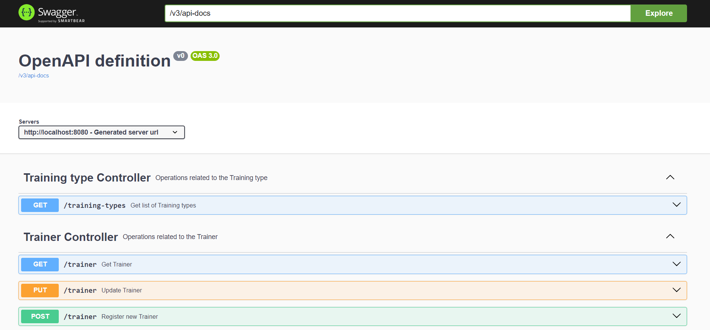
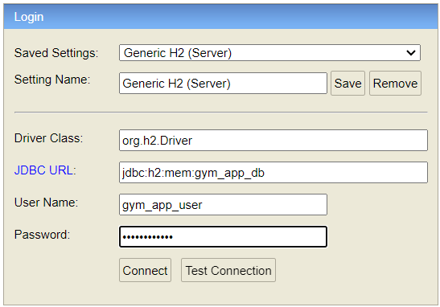

# Gym Application

## Table of Contents

1. [Introduction](#introduction)
2. [Technologies Used](#technologies-used)
3. [Getting Started](#getting-started)
4. [Additional Features](#additional-features)
5. [Contributing](#contributing)
6. [Pay attention](#pay-attention)
7. [Challenges](#pay-attention)

## Introduction

This console application is developed as a task application for Epam company Java Specialization Course.
The application handles gym CRM system.

## Technologies Used

- Java 21
- Spring Boot
- Spring MVC
- Spring AOP
- Spring Actuator
- Prometheus
- Log4j2
- JUnit, Mockito
- Jacoco
- H2
- Liquibase

## Getting Started

- please, download to your PC the gym-app folder from the GitHub repository and extract files from the archive:  
  https://github.com/AndriiChipets/gym-app
- run the command line interface inside the folder "gym-app"
- to run the app, please execute the command: mvn spring-boot:run
- to stop app, press CTRL+C
- that's all you have excess to the "gym-app" endpoints
- to see all endpoints, after "gym-app" is running, please follow the link:  
  http://localhost:9000/swagger-ui/index.html#/
  
- to access the H2 DB, after "gym-app" is running, please follow the link:  
  http://localhost:9000/h2-console
  all credentials for access in the localhost.env file (password: gym_app_1234)  
  

## Additional Features

- According to the task, all methods except login and register user require the authentication,
  so first of all make sure you are login, e.g. with credentials:  
  username = "Fn.Ln"  
  password = "1234567890"
- Implemented spring profiles functionality "dev" and "prod" profiles all with different property files:  
  "dev" - profile by default, server.port = 9000, H2 DB  
  "prod" - server.port = 8000, MySql DB (Doesn't work without additional preparations)
- Implemented two custom health indicators:  
  for DB - http://localhost:9000/actuator/health/database  
  for http session - http://localhost:9000/actuator/health/session
- Implemented two custom prometheus metrics  
  for login counting  
  for free JVM memory gauge in percent
- Readme file to guide developers and contributors

## Contributing

Contributions are welcome! If you have ideas or improvements, feel free to submit a pull request.

## Pay attention

### The application is still under development, so bugs and drawbacks are possible.

## Challenges

To implement custom authentication logic I used the Spring AOP functionality.
That was challenging for me and I spent a lot of time to implement it.
The problem was related to the annotation full qualified name which I had to use
to make annotation @Authenticated active.
So, for now to make methods requiring user authentication before access them
you just need to add @Authenticated above the method signature e.g.

```ruby
    @DeleteMapping
    @Authenticated
    @Operation(summary = "Delete Trainee")
    @ApiResponses(value = {
            @ApiResponse(responseCode = "201", description = "Trainee successfully deleted"),
            @ApiResponse(responseCode = "404", description = "Trainee is not deleted"),
            @ApiResponse(responseCode = "501", description = "Network Authentication Required")
    })
    @ResponseStatus(HttpStatus.OK)
    public void deleteTrainee(@RequestParam @NotBlank String username) {
        traineeService.delete(username);
    }
```
